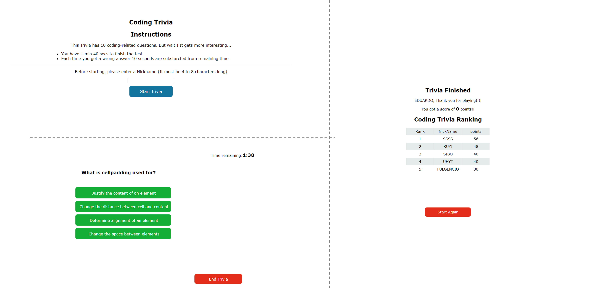

# CODING-TRIVIA

Coding Trivia is a 10 question quizz of coding related topics.

It is a timed test in which the user has 100 seconds to answer all questions (assuuming that a question can be answered in less than 10 seconds).

### ABOUT THE SCORE

- The user gets 5 points for each question answered correctly.
- Each time the user seletcs wrong question, it susbtracts 10 seconds from the remaining time.
- If the user gets to answer all tue question befor the timer ends, the  remaining time at the end of the test is added to the total score gotten questions answered correctly.

### ABOUT THE CODE.

- The Coding Trivia is developed in a single web page, the code hides and shows the corresponding parts according to the quizz flow.
- Questions list is made in a separate file, so it is easier to update them.

THANK YOU!

